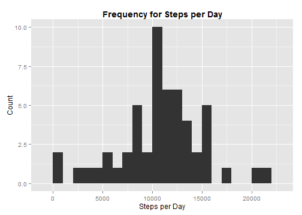
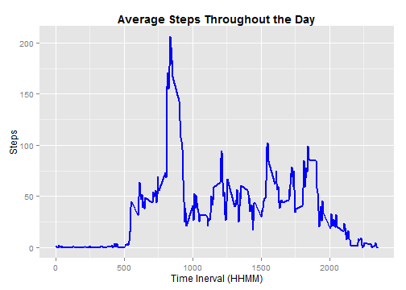
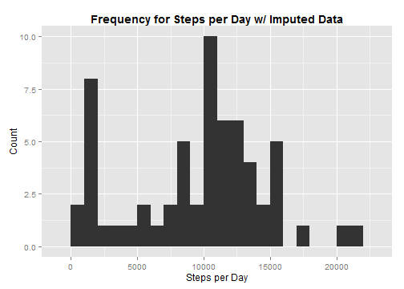
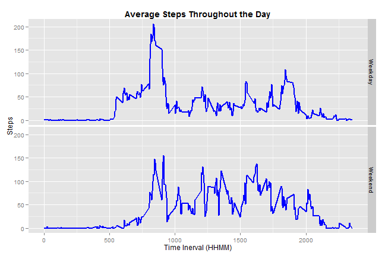
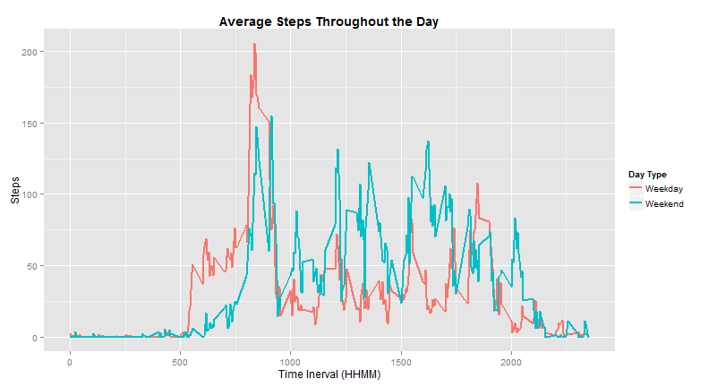

# Reproducible Research: Peer Assessment 1

The following documents the analysis of activity data (number of steps) collected  
at 5-minute intervals for an anonymous individual over October and November 2012.

## Loading and preprocessing the data
Begin the analysis by ingesting the data and cleaning it to prepare for this  
analysis. This step presumes the data file is in a folder called 'data in the  
current working directory.

First, ingest the the data and make a copy of the original to preserve it.


```r
raw.data <- read.csv(".\\data\\activity.csv")
working.data <- raw.data
```


Next, clean the data to prepare it for further analysis by converting the  
provided dates to POSIXct class.


```r
library(lubridate)
working.data$date <- ymd(working.data$date)
```


NB: this component requires installation of the 'lubridate' package.

## What is mean total number of steps taken per day?

As a first-order analysis generate a histogram of the number of steps taken per day.  

To do so, first aggregate the data for the histogram:


```r
## use aggregate function to sum up the steps in each day
hist.data <- with(working.data, aggregate(steps, by = list(date), sum))
## rename the variables in this new data frame
names(hist.data) <- c("Date", "Steps")
## view the first few results of this data frame
head(hist.data)
```

```
##         Date Steps
## 1 2012-10-01    NA
## 2 2012-10-02   126
## 3 2012-10-03 11352
## 4 2012-10-04 12116
## 5 2012-10-05 13294
## 6 2012-10-06 15420
```


Then, build the plot with a bin width of 1000 steps:


```r
library(ggplot2)
hist.plot <- ggplot(hist.data, aes(x = Steps)) + geom_histogram(binwidth = 1000) + 
    ggtitle("Frequency for Steps per Day") + theme(plot.title = element_text(lineheight = 0.8, 
    face = "bold")) + labs(x = "Steps per Day", y = "Count")
hist.plot
```

 


NB: this component requires installation of the 'ggplot2' package.

With that complete, calculate the mean and median steps per day (ignoring NA values)  
as a set of summary statistics for the data.


```r
mean.steps <- mean(hist.data$Steps, na.rm = TRUE)
median.steps <- median(hist.data$Steps, na.rm = TRUE)
```


The mean number of steps taken per day in this study is **10766**.  
The median number of steps is **10765**.

## What is the average daily activity pattern?

To assess the natural activity rhythms of the subject, let's look at the average  
number of steps they take in each 5-minute interval throughout the day.

The first step in doing so is to average the steps across all days for each interval,  
ignoring NAs in the process.


```r
series.data <- with(working.data, aggregate(steps, by = list(interval), mean, 
    na.rm = TRUE))
## rename the variables in this new data frame
names(series.data) <- c("Interval", "Mean.Steps")
## view the first few results of this data frame
head(series.data)
```

```
##   Interval Mean.Steps
## 1        0    1.71698
## 2        5    0.33962
## 3       10    0.13208
## 4       15    0.15094
## 5       20    0.07547
## 6       25    2.09434
```

```r
## note the time interval with the maximum average number of steps during the
## day
max.steps <- series.data$Interval[which.max(series.data$Mean.Steps)]
```


With this data, plot the average steps per interval over the full range of intervals  
to get a sense of the average activity level throughout the day.


```r
series.plot <- ggplot(series.data, aes(x = Interval, y = Mean.Steps)) + geom_line(colour = "blue", 
    size = 1) + ggtitle("Average Steps Throughout the Day") + theme(plot.title = element_text(lineheight = 0.8, 
    face = "bold")) + labs(x = "Time Inerval (HHMM)", y = "Steps")
series.plot
```

 


Clearly, the subject has their highest level of activity in the morning. The  
exact time interval with the highest level of activity is **835**.

## Imputing missing values

One challenge with this data is the lack of measurement for some of the intervals.  
Previous analyses effectively ignored these intervals, but to get a more  
comprehensive picture of the subject's activity level, we can impute the missing  
values.

As a first step in doing this, we'll note just how many values we need to impute.  


```r
## count the number of missing values in the working.data frame
sum.NA <- sum(is.na(working.data$steps))
## assess the percentage of the study that is missing
percent.missing <- round(sum.NA/nrow(working.data) * 100)
```


With these simple calculations, we note there are **2304** missing values.  
This is **13%** of the overall data.

To replace these values, we'll first take the median number of steps for each  
interval in all the data to get sense of the most likely activity level for those  
missing values. We chose this measure over mean to mitigate possible periods of  
large steps skewing the average.


```r
imputed.data <- with(working.data, aggregate(steps, by = list(interval), median, 
    na.rm = TRUE))
## rename the variables in this new data frame
names(imputed.data) <- c("interval", "steps")
## view the first few results of this data frame
head(imputed.data)
```

```
##   interval steps
## 1        0     0
## 2        5     0
## 3       10     0
## 4       15     0
## 5       20     0
## 6       25     0
```


With the imputed values set, we'll create a new data frame of the working data,  
and then replace the intervals missing step values with the imputed values.


```r
full.data <- working.data
## for the entries in the data frame missing steps, replace with the
## corresponding median steps calculated previously
for (i in 1:nrow(full.data)) {
    if (is.na(full.data$steps[i]) == TRUE) {
        full.data$steps[i] <- imputed.data$steps[full.data$interval[i] == imputed.data$interval]
    } else {
    }
}
## verify this operation replaced all NA values
sum(is.na(full.data$steps))
```

```
## [1] 0
```


Now that we have a data set with a complete set of values for the number of steps  
taken, we can re-run some of our earlier analyses to determine the effect of  
imputing missing values on the summary statistics for this data.

First, we'll generate the data for and create a histogram of the total number of  
steps taken per day.


```r
## use aggregate function to sum up the steps in each day
hist.data.imputed <- with(full.data, aggregate(steps, by = list(date), sum))
## rename the variables in this new data frame
names(hist.data.imputed) <- c("Date", "Steps")
```


```r
library(ggplot2)
hist.imputed.plot <- ggplot(hist.data.imputed, aes(x = Steps)) + geom_histogram(binwidth = 1000) + 
    ggtitle("Frequency for Steps per Day w/ Imputed Data") + theme(plot.title = element_text(lineheight = 0.8, 
    face = "bold")) + labs(x = "Steps per Day", y = "Count")
hist.imputed.plot
```

 


Let's see how this imputing process effects our summary statistics of mean and  
median for the data.


```r
mean.steps.imputed <- mean(hist.data.imputed$Steps, na.rm = TRUE)
median.steps.imputed <- median(hist.data.imputed$Steps, na.rm = TRUE)
mean.difference <- as.integer(mean.steps.imputed - mean.steps)
median.difference <- as.integer(median.steps.imputed - median.steps)
mean.per.diff <- round((mean.difference/mean.steps) * 100)
median.per.diff <- round((median.difference/median.steps) * 100)
```


With the imputed data, mean number of steps taken per day in this study is now  
**9503**.  This is a difference of **-1262** or **-12%**.

The median number of steps is now **10395**. This is a difference of **-370** or **-3%**.

Clearly, imputing the data has caused a difference in the summary statistic values  
we get on this data. In the case of the mean number of steps, imputing caused this  
value to drop significantly from 10766 to 9503 -- a -12% change. This may be  
due to a skewing of the initial results by ignoring NA values.  For the median  
number of daily steps, we still see a change, but it is not as significant.  
The value still dropped, but only from 10765 to 10395. This was only a -3% change.

## Are there differences in activity patterns between weekdays and weekends?

For most people with a Monday through Friday work schedule (in the US, for instance),  
their activity level during the work week varies greatly as compared to the   
weekend. Let's take a look at the subject's activity level based on the factor  
of weekday versus weekend.

First, we'll need to determine this designation for each observation in the full data,  
then calculate the average level of activity for the subject in each time interval for  
weekdays and weekends as separate time series.


```r
## determine day of the week for each date
full.data$day <- wday(full.data$date, label = TRUE, abbr = FALSE)
## determine whether or not each day of the week is a weekend or not
full.data$day.type <- ifelse(full.data$day %in% c("Saturday", "Sunday"), "Weekend", 
    "Weekday")
library(reshape2)
## melt the data based on interval, weekend/weekday, and steps
melt.data <- melt(full.data, id = c("interval", "day.type"), measure.vars = c("steps"))
## recast data based on interval and weekend/weekday
day.series.data <- dcast(melt.data, interval + day.type ~ variable, mean)
```


NB: this component requires installation of the 'reshape2' package.

With this aggregation in-hand, we can construct a few plots to analyze the data  
and assess any difference in activity during weekday days versus weekend days.


```r
comparison.panel.plot <- ggplot(day.series.data, aes(x = interval, y = steps)) + 
    geom_line(colour = "blue", size = 1) + facet_grid(day.type ~ .) + ggtitle("Average Steps Throughout the Day") + 
    theme(plot.title = element_text(lineheight = 0.8, face = "bold")) + labs(x = "Time Inerval (HHMM)", 
    y = "Steps")
comparison.panel.plot
```

 


With this view, we note that the subject typically has a high amount of activity  
on weekday mornings, then settles into somewhat low level of activity for the  
rest of the day.  On weekends, the subject seems to wake up later (as evidenced  
by the delayed onset of initial activity as compared to weekdays), but engage in  
a more consistent level of activity as the day goes on. The subject also appears  
to stay up a little later on weekends too.

Noting this understanding of the differences in profile of activity on weekdays  
versus weekends, let's look at the difference in  overall amount of activity by  
plotting the two series on the same graph.


```r
comparison.plot <- ggplot(day.series.data, aes(x = interval, y = steps, group = day.type, 
    colour = day.type)) + geom_line(size = 1) + ggtitle("Average Steps Throughout the Day") + 
    theme(plot.title = element_text(lineheight = 0.8, face = "bold")) + labs(x = "Time Inerval (HHMM)", 
    y = "Steps", colour = "Day Type")
comparison.plot
```

 


In this plot, we can directly see the difference in activity level for our  
subject on weekdays versus weekends. On weekends, the subject seems to have a more  
steady, and generally higher level of activity as compared to weekdays.  In general  
the comparison of the profiles suggest the subject holds a Monday through Friday  
job at which they are sendentary most of the day. Perhaps to compensate for that  
the subject appears to engage in a high level of activity shortly before reporting  
for this job on weekdays. On weekends, they are moving around consistently all  
day, but do not seem to engage in any specific periods of high levels of activity.
